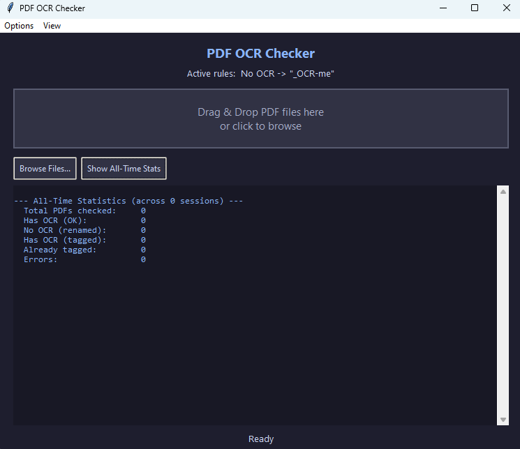

# PDF-OCR-checker (v1)

> [!CAUTION]
> **DISCLAIMER:**  
> This software was generated with **Claude Code** (Anthropic), using model **Claude Opus 4.6**.  
> There is no need to credit this repository - this code was not written by myself. Fork or republish at will.   
> I only publish this because I've seen other people online looking for something similar.   
> **This software will not be updated and will remain at version 1.**
> If you build on it, please change the version number and describe your changes in the README.
>   
> **This is completely vibe-coded but was tested with thousands of PDFs and worked without any problems!**  

A desktop tool that checks PDF files in bulk for searchable text (OCR).  
Files can be automatically renamed with configurable suffixes based on whether they have OCR or not.  
Completely offline and private!  

**Examples:**
- `Invoice-2024.pdf` (no searchable text) becomes `Invoice-2024_OCR-me.pdf`
- `Contract.pdf` (has searchable text) becomes `Contract_OCR-ok.pdf` *(if enabled)*

**Before you use it:**
- This is not a tool to add searchable text to PDFs, use your prefered PDF editor for that!

---

## Table of Contents

1. [What is OCR?](#what-is-ocr)
2. [How the Software Works (Overview)](#how-the-software-works-overview)
3. [Installation](#installation)
4. [How to Use](#how-to-use)
5. [Features](#features)
6. [Project Files](#project-files)

---

## What is OCR?

**OCR** stands for **Optical Character Recognition**. It is a technology that converts images of text (like scanned documents) into actual searchable, selectable text.

- A PDF **with OCR** means you can select text, search for words, and copy/paste from it.
- A PDF **without OCR** is essentially just a picture of a document. You cannot select or search the text inside it.

This tool detects which category each PDF falls into.

---

## How the Software Works (Overview)

Here is a step-by-step summary of what happens when you use this tool:

1. **You provide PDF files** by either dragging them into the window or clicking to browse.
2. **For each PDF file**, the software:
   - Opens the PDF and reads through every page.
   - Tries to extract any text from each page.
   - Counts how many characters of text it found in total.
3. **Decision based on your settings:**
   - If **10 or more characters** of text were found, the PDF is considered to have OCR. Depending on your settings, it is either left untouched (green "OK") or renamed with your "has OCR" suffix (teal "TAGGED").
   - If **fewer than 10 characters** were found, the PDF is considered to have no OCR. Depending on your settings, it is either left untouched or renamed with your "no OCR" suffix (orange "RENAMED").
   - If the file already has the relevant suffix in its name, it is skipped to avoid double-tagging.
4. **A session summary** is shown listing how many files were OK, renamed, skipped, or had errors.
5. **An all-time summary** is shown below it, combining statistics from every session since the last reset. These statistics are saved to a log file so they persist even when the app is closed.

---

## Installation

There are two ways to get this tool. Choose whichever you prefer:

### Option A: Standalone EXE (no Python required)

1. Go to the [**Releases**](../../releases) page.
2. Download **`PDF OCR Checker v1.exe`**.
3. Place it anywhere on your computer and double-click to run. That's it.

The standalone exe is a single file (~31 MB) with everything bundled in. No Python, no setup, no dependencies. You can also drag PDF files directly onto the exe to process them.

### Option B: Python Source (requires Python)

1. Download or clone this repository.
2. Make sure **Python 3.8 or newer** is installed ([python.org](https://www.python.org/downloads/) — check **"Add Python to PATH"** during install).
3. Open the `app` subfolder and **double-click `install.bat`**. This installs the two required packages (PyMuPDF and tkinterdnd2).
4. Double-click **`PDF OCR Checker.bat`** in the root folder to run.

### Building the EXE Yourself

If you want to compile the standalone exe from source, open the `app` subfolder and double-click **`build.bat`**. It installs PyInstaller and builds `standalone/PDF OCR Checker v1.exe` automatically.

---

## How to Use

### With the Standalone EXE

1. Double-click **`PDF OCR Checker v1.exe`** to open the application window.
2. Drag PDF files into the drop zone, or click **"Browse Files..."** to select them.
3. You can also drag PDF files directly onto the exe file icon to auto-process them.

### With the Python Version

There are **three ways** to use the Python version:

#### Option 1: GUI with Drag & Drop (Recommended)

1. Double-click **`PDF OCR Checker.bat`** to open the application window.
2. Open a File Explorer window with your PDF files.
3. Select the PDF files you want to check (you can select multiple with Ctrl+Click or Ctrl+A).
4. Drag them into the drop zone in the application window.
5. Watch the results appear in the log area.

#### Option 2: GUI with File Browser

1. Double-click **`PDF OCR Checker.bat`** to open the application window.
2. Click on the drop zone area or the **"Browse Files..."** button.
3. A standard Windows file picker opens. Navigate to your PDFs and select them.
4. Click "Open" and watch the results.

#### Option 3: Drag onto the .bat File Directly

1. Select your PDF files in File Explorer.
2. Drag them directly onto the **`PDF OCR Checker.bat`** file icon.
3. A command-line window opens, processes all files, and shows the results as text.

---

## Features

### Light / Dark Mode

Switch between a dark theme and a light theme via the **View** menu at the top of the window. Click **"Switch to Light Mode"** or **"Switch to Dark Mode"**. Your preference is saved and remembered the next time you open the app.

### Persistent Statistics & Log File

Every time you process files, the results are saved to a log file (`ocr_checker_log.json`) inside the application folder. This means your cumulative statistics (total files checked, total renamed, etc.) are preserved across sessions. Click the **"Show All-Time Stats"** button to display them at any time.

### Error Log

When the tool encounters an error (e.g., a file not found, a corrupted PDF, or a permission issue), the error message is both displayed in the log area and written to a persistent error log file (`ocr_checker_errors.log`) inside the `app` folder. Each entry is timestamped. This allows you to review past errors even after closing the app.

### Reset Statistics

Go to **Options > Reset All-Time Statistics...** to clear the statistics log file and start fresh. A confirmation dialog will appear before anything is deleted.

### Reset Settings to Defaults

Go to **Options > Reset Settings to Defaults...** to restore all settings (suffixes, theme, font size) back to their original default values. The change is applied immediately to the UI. A confirmation dialog will appear first.

### Reset Error Log

Go to **Options > Reset Error Log...** to clear all recorded errors from the error log file. A confirmation dialog will appear before anything is deleted.

### Font Size

Change the font size via the **View > Font Size** submenu. Available sizes are 8, 9, 10, 11, 12, and 14. The current size is indicated with a `>` prefix. Your preference is saved and remembered between sessions.

### Configurable Suffixes (Options Menu)

Go to **Options > Suffix Settings...** to open the settings dialog. You can:

- **Change the suffix** for files without OCR (default: `_OCR-me`).
- **Enable/disable renaming** for files without OCR.
- **Set a suffix** for files with OCR (default: `_OCR-ok`).
- **Enable/disable renaming** for files with OCR.
- **Enable "Remove mode"** to strip suffixes from files instead of adding them.

This means you can:
- Rename only files without OCR (default behavior).
- Rename only files with OCR.
- Rename both at the same time with different suffixes.
- Disable all renaming and just use the tool to check files.
- **Remove suffixes**: Enable the checkbox and drop in files that were previously renamed. For example, `report_OCR-me.pdf` becomes `report.pdf`. Useful for undoing a previous renaming run.

Settings are saved to `ocr_checker_config.json` and remembered between sessions.

---

## Project Files

| File | Location | Purpose |
|------|----------|---------|
| `PDF OCR Checker.bat` | Root | A shortcut to launch the Python version. Double-click to open the GUI, or drag files onto it. |
| `README.md` | Root | This documentation file. |
| `SOURCE_CODE.md` | Root | Full source code with line-by-line explanations for beginners. |
| `Preview.png` | Root | Screenshot shown in this README. |
| `pdf_ocr_checker.py` | `app/` | The main program. Contains all logic for checking PDFs, the GUI, settings, and logging. |
| `install.bat` | `app/` | A one-time setup script. Installs the required Python packages. |
| `build.bat` | `app/` | Compiles the standalone exe from source using PyInstaller. |
| `requirements.txt` | `app/` | A list of the required Python packages and their minimum versions. |
| `ocr_checker_config.json` | `app/` *(auto-created)* | Stores your settings (suffixes, dark/light mode, font size). |
| `ocr_checker_log.json` | `app/` *(auto-created)* | Stores cumulative statistics and session history. |
| `ocr_checker_errors.log` | `app/` *(auto-created)* | Timestamped log of all errors encountered during processing. |
| `PDF OCR Checker v1.exe` | [Releases](../../releases) | Standalone exe. No Python required. Download from the Releases page. |